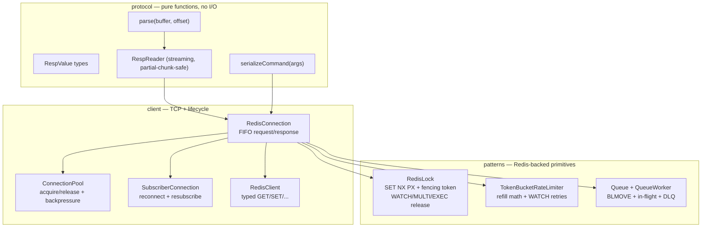

# redis-client-ts

A Redis client built from scratch in TypeScript over raw TCP, plus a small set of production-shaped patterns built on top of that client — distributed lock, token-bucket rate limiter, reliable work queue.

This is a learning + CV project. The point is not to compete with `ioredis` on ergonomics or throughput; the point is to demonstrate end-to-end understanding of the wire protocol, connection lifecycle, and the design tradeoffs behind common Redis-backed patterns.

```
142 tests / 119 unit / 23 Docker integration / 0 runtime deps in the protocol & client layers
```

## What's in it

**Protocol layer** — RESP2 over raw TCP. Streaming parser that handles partial chunks; serializer for command frames; no third-party Redis library involved.

**Client layer** — TCP connection with FIFO request/response correlation (pipelining), typed `RedisClient` for core commands (GET/SET/DEL/EXPIRE/INCR/HGET/HSET/PUBLISH), connection pool with backpressure, dedicated `SubscriberConnection` for pub/sub with exponential-backoff reconnect and silent resubscribe.

**Patterns layer** — `RedisLock` (single-node SET-NX-PX with monotonic fencing tokens, WATCH/MULTI/EXEC release), `TokenBucketRateLimiter` (hash-backed state with WATCH/MULTI/EXEC and per-instance serialization), `Queue` + `QueueWorker` (at-least-once delivery via LPUSH/BLMOVE with per-consumer in-flight lists, MULTI-atomic nack, DLQ on retry exhaustion).

## Architecture



Every arrow is a real dependency. The protocol layer is pure functions (parser is tested with `Buffer.from(...)` and fixed offsets, no sockets). The client layer isolates I/O. The patterns layer takes a `CommandRunner` interface so it can be unit-tested with a scripted mock and integration-tested against real Redis.

## Quick start

```bash
# 1. Start Redis
docker compose up -d

# 2. Install deps
pnpm install         # or: npm install / yarn install

# 3. Run the tests
pnpm test            # unit tests, no Redis needed
pnpm test:integration  # against the Docker Redis from step 1

# 4. Run the demo
pnpm exec tsx examples/server.ts   # terminal 1
pnpm exec tsx examples/worker.ts   # terminal 2
# Then: curl -X POST localhost:3000/jobs -H 'content-type: application/json' -d '{"payload":"hi"}'
```

See [`examples/README.md`](examples/README.md) for the full demo walkthrough.

## The three patterns and what's interesting about each

### Distributed lock with fencing tokens — [`src/patterns/lock.ts`](src/patterns/lock.ts)

Single-node `SET <key> <secret> NX PX <ttl>` for the atomic claim, then `INCR <key>:fence` for a monotonic token issued only on successful claim. Fence numbers grow strictly in acquire order — losers don't INCR, so there are no gaps.

Release uses `WATCH/MULTI/EXEC` for atomic check-and-delete instead of Lua: WATCH the lock key, GET it, compare to our secret, then either UNWATCH (if it isn't ours anymore — expired or re-acquired) or MULTI/DEL/EXEC. WATCH guarantees the transaction aborts if the key was modified between our GET and EXEC, so we can never DEL a key that's since been re-acquired by another holder.

**The point of fencing tokens** is what Martin Kleppmann's [How to do distributed locking](https://martin.kleppmann.com/2016/02/08/how-to-do-distributed-locking.html) argues: any lock is unsafe against holder process pauses longer than its TTL, no matter how Redlock-correct the lock itself is. The lock returns a monotonic token; **the resource server** must be the one that compares incoming tokens and rejects stale writers. We document this clearly and return the token in the `Lock` shape so callers can forward it.

### Token bucket rate limiter — [`src/patterns/rate-limiter.ts`](src/patterns/rate-limiter.ts)

State is a single Redis hash per key: `{ tokens: float, ts: ms }`. Each acquire reads the prior state, adds `(now - ts) × rate` tokens (capped at capacity), then either consumes 1 or denies with a `retryAfterMs` hint. Cold start treats the bucket as full so a brand-new key always wins its first request.

Atomicity reuses WATCH/MULTI/EXEC (same primitive as the lock). Aborted EXECs retry up to `maxRetries` (default 3), after which the limiter throws `RateLimiterContentionError` rather than returning a misleading deny — that case isn't a legitimate rate-limit decision, it's pathological contention.

**One bug worth highlighting** because it was caught by integration tests, not unit tests: parallel `tryAcquire` calls on a single limiter instance collide with `ERR MULTI calls can not be nested`. Redis transaction state is per-connection, and a shared limiter on one connection cannot run two transactions at once. The fix is internal per-instance serialization (chain calls through a promise so one transaction is in flight at a time). The unit tests, using a scripted mock runner, would never have surfaced this — it took two real connections firing 20 parallel acquires against real Redis to find it. The kind of thing you only see if you actually wire up the integration test.

### Reliable work queue — [`src/patterns/queue.ts`](src/patterns/queue.ts)

At-least-once delivery via the standard reliable-queue shape that Sidekiq, Resque, and Celery all use at the bottom:

- `queue:<name>` — main FIFO list.
- `queue:<name>:inflight:<consumerId>` — per-consumer in-flight list.
- `queue:<name>:dlq` — dead-letter list.

`Queue.enqueue` LPUSHes a JSON envelope `{id, attempts, payload}`. `QueueWorker.dequeue` uses `BLMOVE` to atomically move from main to its per-consumer in-flight list — the message is in exactly one list at any moment. `ack` LREMs from in-flight. `nack` uses MULTI to atomically LREM-then-LPUSH back to main (attempts+1) or to the DLQ (once attempts hits maxAttempts); splitting that pair would lose messages on crash.

`reclaim()` loops `LMOVE` inflight→main to recover abandoned messages on worker restart. Relies on stable `consumerId` across restarts to be useful.

**One thing this library does NOT do**: automatic visibility timeout. Doing it correctly requires either per-message deadline rewrites on every dequeue (extra round trip + a sweeper) or Redis Streams. Both are out of scope. The caller wraps its processing in its own timer and calls `nack`; `reclaim()` covers crash recovery. This is the same line Sidekiq and Resque draw at the bottom layer.

## What's explicitly out of scope

| Out of scope                                         | Why                                                                                                                                                                   |
| ---------------------------------------------------- | --------------------------------------------------------------------------------------------------------------------------------------------------------------------- |
| RESP3, RESP HELLO                                    | RESP2 is enough to teach framing and is what every classic client first supports.                                                                                     |
| Redis Cluster, Sentinel                              | Stateful failover is its own large topic; doesn't add learning value for the protocol/patterns story.                                                                 |
| Lua scripting (`EVAL`)                               | Atomic check-and-modify via Lua is the "easy" answer — but it doesn't teach transactions. WATCH/MULTI/EXEC teaches optimistic concurrency, which is the real concept. |
| Redis Streams (`XADD` / `XREADGROUP`)                | A consumer-group queue is a different system from the list-based queue we built. Worth its own v2.                                                                    |
| Full command coverage                                | Redis has 400+ commands. We add only what the patterns need.                                                                                                          |
| Multi-instance Redlock                               | Without fencing tokens, multi-node Redlock is unsafe anyway (Kleppmann). With fencing tokens, single-node is safety-equivalent for the actual protected resource.     |
| Competing with `ioredis` on ergonomics or throughput | A v2 in Rust or Go is the right place to revisit performance.                                                                                                         |

## How the tests are structured

Bottom-up, test-first:

```
tests/
  protocol/         # pure-function unit tests (parser, serializer, RespReader)
  client/
    *.test.ts       # mocked-socket unit tests
    integration/    # against Docker Redis
  patterns/
    *.test.ts       # scripted-runner unit tests
    integration/    # against Docker Redis
```

Unit tests run anywhere with no setup. Integration tests need Redis on `localhost:6379` (start with `docker compose up -d`) and have an `@integration` tag in their describe names so they're easy to filter.

The rule throughout: write a failing test that pins the wire shape or behavior, then write the minimum code to make it pass. Every commit on `client/phase-N` branches follows this loop. See the [progress log](redis_client_roadmap_f1ba5009.plan.md) for what each phase covered.

## Status

- ✅ Phase 0 — RESP2 protocol (parser, serializer, streaming reader)
- ✅ Phase 1 — TCP connection + core KV commands
- ✅ Phase 2 — Pipelining + connection pool with backpressure
- ✅ Phase 3 — Pub/sub with reconnect + resubscribe replay
- ✅ Phase 4 — Distributed lock with fencing tokens
- ✅ Phase 5 — Token bucket rate limiter
- ✅ Phase 6 — Reliable message queue
- 🚧 Phase 7 — CV polish (this README, demo app, public exports)

## License

MIT
