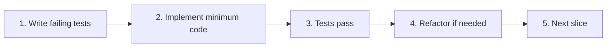
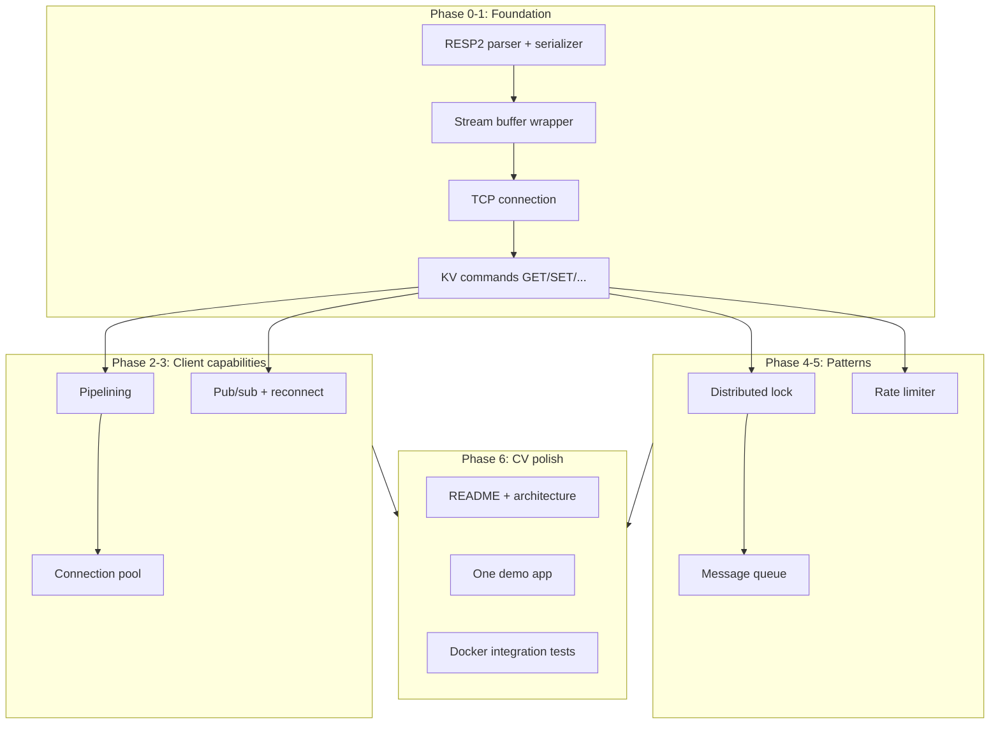

# Redis Client Improvement Roadmap

## Progress log

| Date | Step | Status | Notes |
|---|---|---|---|
| 2026-05-30 | Phase 0 — Arrays (`*`) | **Done** | 11 new tests; recursive `parse` in [parser.ts](src/protocol/parser.ts). Commit `5959ea7` on `parser/arrays`. |
| 2026-05-30 | Phase 0 — Serializer | **Done** | 7 tests in [serializer.test.ts](tests/protocol/serializer.test.ts); [serializer.ts](src/protocol/serializer.ts) with `serializeCommand` + `encodeBulkString`. Commit `cea26a1` on `parser/serializer`. 49 tests passing. |
| 2026-05-30 | Phase 0 — Stream wrapper | **Done** | 7 tests in [stream.test.ts](tests/protocol/stream.test.ts); `RespReader` in [stream.ts](src/protocol/stream.ts). Commit `b9cda98` on `parser/stream`. 56 tests passing. **Phase 0 complete.** |
| 2026-05-30 | Phase 1 — TCP + KV client | **Done** | Merged to `main` (`3c1c450`). 79 tests passing (6 integration). |
| 2026-05-30 | Phase 2 — Pipelining + pool | **Done** | Branch `client/phase-2` (2 commits). 89 tests passing. |
| 2026-05-31 | Phase 3 — Pub/sub + reconnect | **Done** | Branch `client/phase-3` (3 commits). `SubscriberConnection` with confirmation-based subscribe, exponential backoff reconnect, resubscribe replay. 103 tests passing (3 integration including CLIENT KILL resubscribe). |
| 2026-05-31 | Phase 4 — Distributed lock + fencing tokens | **Done** | Branch `client/phase-4` (3 commits). Single-node SET-NX-PX acquire, WATCH/MULTI/EXEC release (no Lua), monotonic fence via INCR `<key>:fence`. 115 tests passing (4 integration including mutex, TTL expiry, fence monotonicity, safe-release-after-expiry). |
| 2026-05-31 | Phase 5 — Token bucket rate limiter | **Done** | Branch `client/phase-5` (2 commits). Hash-backed state with WATCH/MULTI/EXEC; injectable clock; bounded retries; internal per-instance serialization to respect Redis's per-connection transaction state. 126 tests passing (4 integration including burst, refill, and concurrent acquirers honoring the capacity bound). |
| 2026-05-31 | Phase 6 — Reliable message queue | **Done** | Branch `client/phase-6` (2 commits). LPUSH + BLMOVE + per-consumer in-flight lists; ack/nack/reclaim; DLQ on attempts ≥ maxAttempts; nack atomic via MULTI. Visibility timeout intentionally NOT enforced (caller's responsibility). 142 tests passing (6 integration including FIFO, ack, nack-with-retry, DLQ routing, reclaim recovery, blocking timeout). |
| 2026-05-31 | Phase 7 — CV polish | **Done** | Branch `client/phase-7` (4 commits). index.ts exposes every pattern; demo: HTTP server (per-IP rate limit + enqueue) + worker (dequeue + retry + DLQ + reclaim); top-level README with architecture diagram, per-pattern design writeups, and the "out of scope" tradeoff table. 143 tests passing. |
| — | Phase 8 (optional stretch) — Cache-aside helper | Next | — |

---

Your list mixes **three different layers**. Building them out of order creates rework (e.g. a rate limiter without a working TCP client is just a mock).

| Recommended feature | What it actually is | Layer |
|---|---|---|
| Key-value store | Core Redis commands (GET, SET, DEL, EXPIRE, INCR, HGET, HSET) | **Client** — not a pattern on top |
| Pub/sub | Dedicated connection mode + reconnect/resubscribe | **Client** |
| Rate limit | Token bucket or sliding window using INCR/EXPIRE or Lua-free atomic patterns | **Pattern** |
| Locking | Redlock-style distributed lock + fencing tokens | **Pattern** |
| Message queue | List-based queue (LPUSH/BRPOP) or reliable queue with visibility timeout | **Pattern** |
| All other Redis features | Unbounded — must be curated | **Stretch / v1.5** |

**Important:** "Key-value store" is not something you add after the client — it **is** the client. For a CV, the story is: *I built the wire protocol and client; then I built production patterns on my own client.*

---

## Development methodology: bottom-up, test-first

This is a hard constraint from [CLAUDE.md](CLAUDE.md): *"Test-driven where reasonable: write the test, then the implementation."* Every phase below follows the same loop you already used for bulk strings (PR #1).



**Rules for every slice:**

1. **Tests before code** — add or extend tests in `tests/` first; run them and confirm they fail for the right reason.
2. **One concept per PR** — e.g. arrays only, then serializer only. No multi-feature dumps.
3. **Bottom-up within each layer** — protocol unit tests → stream wrapper unit tests → client unit tests (mocked socket) → Docker integration tests. Do not jump to integration tests before the unit layer is green.
4. **Pure functions tested in isolation** — parser and serializer stay pure; test with `Buffer.from(...)` and fixed offsets, no TCP needed.
5. **Side effects tested in layers** — connection/pool/pub/sub get unit tests with a fake or mocked socket first; real Redis integration tests come after.

**Test file layout (mirrors `src/`):**

```
tests/
  protocol/
    parser.test.ts       ← exists; extend for arrays
    serializer.test.ts   ← new
    stream.test.ts       ← new
  client/
    connection.test.ts   ← new (unit, mocked)
    pipelining.test.ts
    pool.test.ts
    pubsub.test.ts
    integration/         ← Docker Redis, run last in each phase
  patterns/
    lock.test.ts
    rate-limiter.test.ts
    queue.test.ts
```

**What "bottom-up" means in practice for the next slice (pipelining + pool):**

| Step | Action |
|---|---|
| 1 | Add [pipelining.test.ts](tests/client/pipelining.test.ts): N commands before responses; FIFO resolution |
| 2 | Add [pool.test.ts](tests/client/pool.test.ts): acquire, release, backpressure at capacity |
| 3 | Implement pipelining then pool |
| 4 | Commit on a dedicated branch |

*(Phase 1 completed 2026-05-30 — see Progress log.)*



---

## Recommended build order (depth-first)

### Phase 0 — Finish the protocol layer — **Complete**

1. **Arrays (`*`)** — **Done.**
2. **Serializer** — **Done.**
3. **Stream wrapper** — **Done.** `RespReader` in [stream.ts](src/protocol/stream.ts).

**Exit criteria:** met — 56 protocol unit tests passing.

---

### Phase 1 — TCP client + key-value store

This delivers feature **#3 (key-value store)**.

Test-first, bottom-up within the client layer:

1. **Connection (unit tests first)**
   - Tests: mocked `net.Socket` or test double — write path sends serialized bytes; `data` events produce parsed `RespValue`; one in-flight command resolves correctly.
   - Then implement: [connection.ts](src/client/connection.ts).

2. **Core commands (unit tests first)**
   - Tests: verify each command method calls serializer with correct args and maps response types (bulk → string/null, integer → number, error → throw).
   - Then implement: thin `get`, `set`, `del`, `expire`, `incr`, `hget`, `hset` methods.

3. **Integration tests (last in this phase)**
   - Tests: new `tests/client/integration/kv.test.ts` against [docker-compose.yml](docker-compose.yml) — SET/GET round-trip, DEL, EXPIRE, INCR, hash ops.
   - Fix any wiring bugs revealed by real Redis; do not write integration tests before unit tests are green.

**Why before pub/sub:** you learn sockets, framing, and error handling on the simple request/response path first. Pub/sub is a different connection lifecycle.

**Exit criteria:** unit tests green; integration test proves real Redis over TCP with zero third-party Redis libraries.

---

### Phase 2 — Pipelining + connection pool

Not on your list, but **required infrastructure** before patterns and pub/sub at scale.

1. **Pipelining** — tests first: N commands sent before any response arrives; responses resolve in FIFO order; error on one frame rejects its promise only. Then implement.
2. **Connection pool** — tests first: acquire when slot free; wait/reject at capacity; release returns slot. Then implement.

**Why before patterns:** rate limiting and locking under load benefit from pipelining; pool teaches resource bounds — strong CV talking points.

---

### Phase 3 — Pub/sub (feature #2)

1. **Unit tests first** — mock socket: SUBSCRIBE writes correct bytes; incoming push message parsed and dispatched to handler; unsubscribe removes channel.
2. **Reconnect tests** — simulate disconnect event; assert backoff + resubscribe replay (can use fake timer + mock socket before real Redis).
3. **Integration tests last** — publisher on connection A, subscriber on B; kill/restart Redis container, subscriber resubscribes.

**Exit criteria:** unit tests green; integration test passes against Docker Redis.

---

### Phase 4 — Distributed locking (feature #4)

Build **before** rate limit and queue — lock primitives are reused by the queue for exclusive consumers.

1. **Tests first** — acquire succeeds when key free; fails when held; TTL expiry allows re-acquire; release only with matching token; fencing token rejects stale holder.
2. **Then implement** — single-node `SET NX PX`; Redlock-style multi-node (document single-Redis dev limitation); fencing tokens.

**CV angle:** shows you understand distributed systems failure modes (not just "I called SET").

---

### Phase 5 — Rate limiter (feature #1)

Pick **one** algorithm (sliding window or token bucket) — decide in tests before coding:

1. **Unit tests first** — mock client: N allowed requests pass; (N+1)th rejected; window/bucket resets after TTL.
2. **Integration tests** — real Redis: concurrent callers, assert limit holds.
3. **Then implement** — use pipelining for multi-key read/write path.

---

### Phase 6 — Message queue (feature #5)

Simple **reliable-enough** queue, not a full SQS clone. Tests define behavior before implementation:

1. **Unit tests first** — enqueue/dequeue ordering; empty queue blocks or times out; ack removes message; nack/timeout returns to queue; DLQ after N failures.
2. **Then implement** — `LPUSH` + `BRPOP` (extend client commands); visibility timeout; dead-letter queue.
3. **Integration tests last** — producer/consumer against Docker Redis.

**Do not use pub/sub as the queue** — pub/sub is fire-and-forget with no persistence. Pub/sub is for notifications; the queue is for work items.

---

### Phase 7 — CV polish (highest ROI for a student CV)

No fixed deadline means **stop adding features when Phases 0–6 are solid** and invest here:

1. **README** — architecture diagram, "why from scratch", layer table, how to run tests with Docker.
2. **One demo app** — e.g. API rate-limited with your limiter + job worker consuming from your queue. Shows end-to-end usage without requiring a production deployment.
3. **Update [CLAUDE.md](CLAUDE.md) status** — currently all unchecked; keep it accurate as you go.
4. **Optional benchmark** — pipelined GET latency vs `ioredis` on localhost. One chart in README; not a focus area.

---

## What to do with "all other Redis features" (#6)

**Do not try to implement everything built on Redis.** That list includes caching, session stores, leaderboards, geospatial, full-text search, graph, time-series, etc. — each is a product, not a client feature.

Instead, add **at most 1–2 stretch patterns** after Phase 6, only if they reuse commands you already have:

| Stretch pattern | Redis commands needed | CV value | Priority |
|---|---|---|---|
| Cache-aside helper | GET, SET, EXPIRE | High — universal pattern | **Recommended** |
| Leaderboard | ZADD, ZRANGE (new commands) | Medium — shows sorted sets | Optional |
| Idempotency store | SET NX EX | Medium — pairs with queue | Optional |
| Session store wrapper | HSET, HGET, EXPIRE | Low — thin wrapper over hash | Skip |
| Delay / priority queue | ZADD + ZRANGEBYSCORE | Medium — reuses queue story | Optional |
| Bloom filter / RedisJSON / modules | Module commands | Low for this project | **Out of scope** |
| Streams consumer groups | XADD, XREADGROUP | High conceptually | **Defer to v1.5** (currently out of scope in CLAUDE.md) |

**Recommendation:** after the core 3 patterns, add **cache-aside helper** only. It reuses GET/SET/EXPIRE, takes ~1 focused session, and interviewers recognize it immediately. Skip leaderboard unless you specifically want sorted-set command coverage.

---

## Features I'd add that weren't on your list

These strengthen the CV story without scope creep:

1. **Pipelining** — already planned; mention explicitly because recommenders often skip it.
2. **Connection pool with backpressure** — concurrency + resource management.
3. **Reconnect with exponential backoff** — part of pub/sub, but worth calling out as a standalone concern.
4. **Docker integration test harness** — proves it works against real Redis; rare in student projects.
5. **Architecture write-up** — separate short doc or README section: parser design, streaming contract, pub/sub dual-connection model, Redlock tradeoffs.

---

## What to explicitly keep out of v1

Stay disciplined — these dilute the "built from scratch" narrative:

- RESP3, Redis Cluster, Sentinel
- Streams, Lua scripting, Redis modules
- Full command coverage (Redis has 400+ commands)
- Competing with `ioredis` on API ergonomics

Your v2 Rust/Go rewrite is the right place to revisit performance and broader command support.

---

## Summary ordering

| Order | Work item | Maps to your # |
|---|---|---|
| 1 | Arrays + serializer + stream wrapper | (foundation) |
| 2 | TCP + KV commands | **#3 key-value** |
| 3 | Pipelining + pool | (infrastructure) |
| 4 | Pub/sub + reconnect | **#2 pub/sub** |
| 5 | Distributed lock | **#4 locking** |
| 6 | Rate limiter | **#1 rate limit** |
| 7 | Message queue | **#5 message queue** |
| 8 | README + demo + integration tests | (CV standout) |
| 9 | Cache-aside (optional stretch) | partial **#6** |

**Next immediate step:** Phase 2 — pipelining with response correlation, then connection pool with backpressure.
